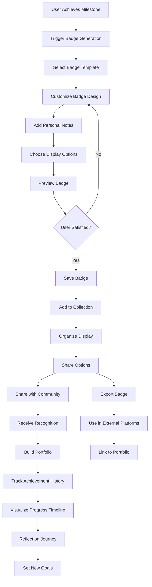

```mermaid
graph TD
    A[User Achieves Milestone] --> B[Trigger Badge Generation]
    B --> C[Select Badge Template]
    C --> D[Customize Badge Design]
    D --> E[Add Personal Notes]
    E --> F[Choose Display Options]
    
    F --> G[Preview Badge]
    G --> H{User Satisfied?}
    H -- No --> D
    H -- Yes --> I[Save Badge]
    
    I --> J[Add to Collection]
    J --> K[Organize Display]
    K --> L[Share Options]
    
    L --> M[Share with Community]
    M --> N[Receive Recognition]
    N --> O[Build Portfolio]
    
    L --> P[Export Badge]
    P --> Q[Use in External Platforms]
    Q --> R[Link to Portfolio]
    
    O --> S[Track Achievement History]
    S --> T[Visualize Progress Timeline]
    T --> U[Reflect on Journey]
    U --> V[Set New Goals]
``` 