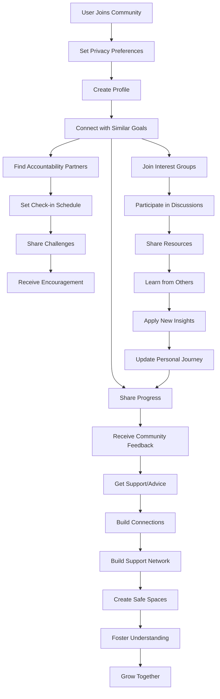

```mermaid
graph TD
    A[User Joins Community] --> B[Set Privacy Preferences]
    B --> C[Create Profile]
    C --> D[Connect with Similar Goals]
    
    D --> E[Share Progress]
    E --> F[Receive Community Feedback]
    F --> G[Get Support/Advice]
    G --> H[Build Connections]
    
    D --> I[Find Accountability Partners]
    I --> J[Set Check-in Schedule]
    J --> K[Share Challenges]
    K --> L[Receive Encouragement]
    
    D --> M[Join Interest Groups]
    M --> N[Participate in Discussions]
    N --> O[Share Resources]
    O --> P[Learn from Others]
    
    P --> Q[Apply New Insights]
    Q --> R[Update Personal Journey]
    R --> E
    
    H --> S[Build Support Network]
    S --> T[Create Safe Spaces]
    T --> U[Foster Understanding]
    U --> V[Grow Together]
``` 