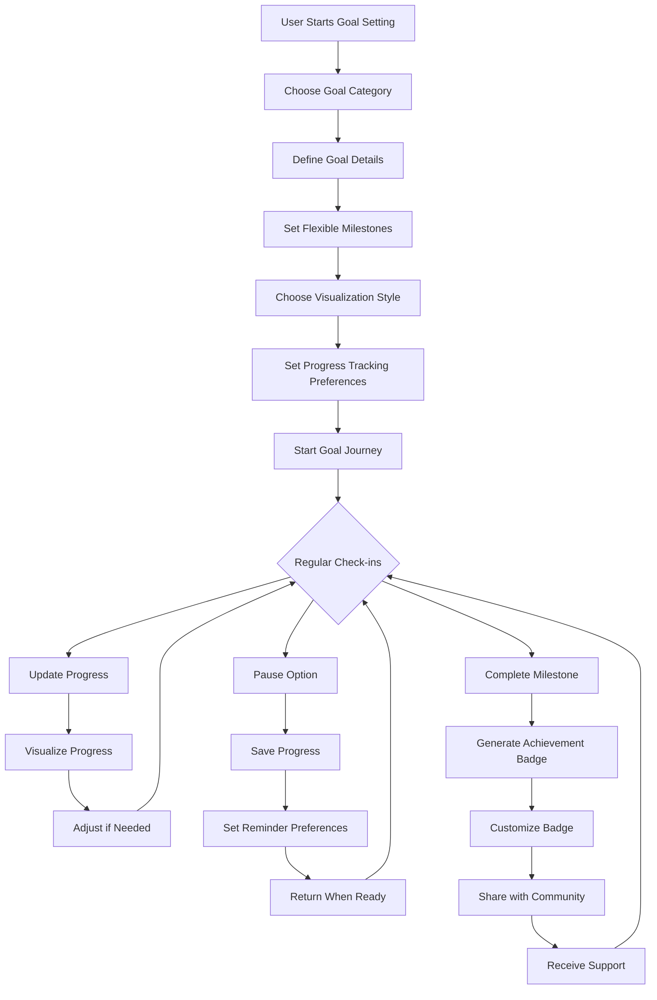

```mermaid
graph TD
    A[User Starts Goal Setting] --> B[Choose Goal Category]
    B --> C[Define Goal Details]
    C --> D[Set Flexible Milestones]
    D --> E[Choose Visualization Style]
    E --> F[Set Progress Tracking Preferences]
    
    F --> G[Start Goal Journey]
    G --> H{Regular Check-ins}
    H --> I[Update Progress]
    I --> J[Visualize Progress]
    J --> K[Adjust if Needed]
    K --> H
    
    H --> L[Pause Option]
    L --> M[Save Progress]
    M --> N[Set Reminder Preferences]
    N --> O[Return When Ready]
    O --> H
    
    H --> P[Complete Milestone]
    P --> Q[Generate Achievement Badge]
    Q --> R[Customize Badge]
    R --> S[Share with Community]
    S --> T[Receive Support]
    T --> H
``` 